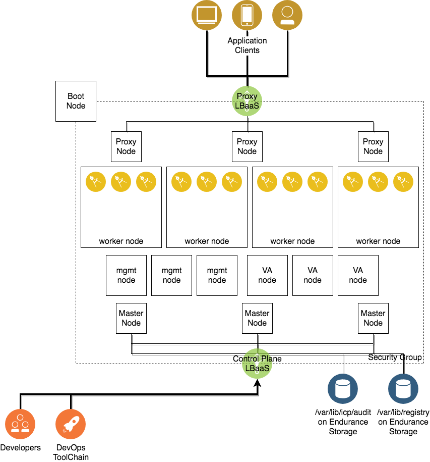

# Terraform ICP IBM Cloud

This Terraform example configurations uses the [IBM Cloud  provider](https://ibm-cloud.github.io/tf-ibm-docs/index.html) to provision virtual machines on IBM Cloud Infrastructure (SoftLayer)
and [TerraForm Module ICP Deploy](https://github.com/ibm-cloud-architecture/terraform-module-icp-deploy) to prepare VSIs and deploy [IBM Cloud Private](https://www.ibm.com/cloud-computing/products/ibm-cloud-private/) on them in Highly Available configuraiton.  This Terraform template automates best practices learned from installing ICP on IBM Cloud Infrastructure.

## Architecture Diagram



## Pre-requisites

* Working copy of [Terraform](https://www.terraform.io/intro/getting-started/install.html)
  * As of this writing, IBM Cloud Terraform provider is not in the main Terraform repository and must be installed manually.  See [these steps](https://ibm-cloud.github.io/tf-ibm-docs/index.html#using-terraform-with-the-ibm-cloud-provider).  We tested this automation script against v0.9.1 of the Terraform provider.
* The template is tested on VSIs based on Ubuntu 16.04.  RHEL is not supported in this automation.

### Environment preparation

Download the IBM Cloud Private docker and installation binaries and save them to the `icp-install` directory.  

### Using the Terraform templates

1. git clone the repository

1. Create a `terraform.tfvars` file to reflect your environment.  Please see [variables.tf](variables.tf) and below tables for variable names and descriptions.  Here is an example `terraform.tfvars` file:


```
sl_username = "<my username>"
sl_api_key = "<my api key>"
key_name = "my-ssh-key"
datacenter = "dal13"
domain = "dal13.icp.com"
os_reference_code = "UBUNTU_16_64"
icp_inception_image = "ibmcom/icp-inception:2.1.0.2-ee"
image_location = "icp-install/ibm-cloud-private-x86_64-2.1.0.2.tar.gz"
docker_package_location = "icp-install/icp-docker-17.09_x86_64.bin"

master = {
  nodes = "3"
}

proxy = {
  nodes = "3"
}

worker = {
  nodes = "3"
}

mgmt = {
  nodes = "3"
}

va = {
  nodes = "3"
}
```

1. Run `terraform init` to download depenencies (modules and plugins)

1. Run `terraform plan` to investigate deployment plan

1. Run `terraform apply` to start deployment.


### Automation Notes

#### Boot Node private registry

The automation will create a boot node VSI that the Terraform automation SSHes to.  The automation performs the following steps on the boot node:

1. Install docker-ce from the official docker repo.
1. Set up [direct-lvm](https://docs.docker.com/storage/storagedriver/device-mapper-driver/#configure-direct-lvm-mode-for-production) mode using the docker volume.
1. Copy the binary packages (specified in `docker_package_location` and `image_location`) to `/tmp` on the boot node.
1. Load all images into the local docker registry.
1. Create a private image registry and push all of the ICP images into it.

The remainder of the automation installs ICP using the private image registry containing the ICP images.

#### Security Groups

The automation leverages Security Groups to lock down public and private access to the cluster.  

- Inbound communication to the master and proxy nodes are only permitted on ports from the private subnet that the LBaaS is provisioned on.  
- Inbound SSH to the boot node is permitted from all addresses on the internet.  
- All outbound communication is allowed.  
- All other communication is only permitted between cluster nodes.

#### LBaaS

The automation exposes the Master control plane to the Internet on:
- TCP port 8443 (master console)
- TCP port 8500 (private registry)
- TCP port 8001 (Kubernetes API)
- TCP port 9443 (OIDC authentication endpoint)

The automation exposes the Proxy nodes to the internet on:
- TCP port 443 (https)
- TCP port 80 (http)

### Terraform configuration

Please see [variables.tf](variables.tf) for additional parameters.

| name | required                        | value        |
|----------------|------------|--------------|
| `sl_username`   | yes          | Username for IBM Cloud infrastructure account |
| `sl_api_key`   | yes          | API Key for IBM Cloud infrastructure account |
| `key_name`   | no           | SSH key to add to `root` for all created VSI instances.  Note that the automation generates its own SSH keys so these are additional keys that can be used for access |
| `datacenter`   | yes           | Datacenter to place all objects in |
| `os_reference_code`   | yes           | OS to install on the VSIs.  Use the [API](https://api.softlayer.com/rest/v3/SoftLayer_Virtual_Guest_Block_Device_Template_Group/getVhdImportSoftwareDescriptions.json?objectMask=referenceCode) to determine valid values. Only Ubuntu 16.04 was tested. Note that the boot node OS can be specified separately (defaults to `UBUNTU_16_64` to save licensing costs). |
| `icp_inception_image` | yes | The ICP installer image to use.  This corresponds to the version of ICP to install. |
| `image_location` | no | The local path to where the binaries are saved. |
| `docker_package_location` | no | The local path to where the IBM-provided docker installation binary is saved. If not specified and using Ubuntu, will install latest `docker-ce` off public repo. |
| `private_network_only` | no | Specify true to remove the cluster from the public network. If public network access is disabled, note that to allow outbound internet access you will require a Gateway Appliance on the VLAN to do Source NAT. Additionally, the automation requires SSH access to the boot node to provision ICP, so a VPN tunnel may be required.  The LBaaS for both the master and the control plane will still be provisioned on the public internet, but the cluster nodes will not have public addresses configured. |
| `private_vlan_router_hostname` | no | Private VLAN router to place all VSIs behind.  e.g. bcr01a. See Network > IP Management > VLANs in the portal. Leave blank to let the system choose. This option should be used when setting `private_network_only` to true along with `private_vlan_number` using a private VLAN that is routed with a Gateway Appliance. |
| `private_vlan_number` | no | Private VLAN number to place all VSIs on.  e.g. 1211. See Network > IP Management > VLANs in the portal. Leave blank to let the system choose. This option should be used when setting `private_network_only` to true along with `private_vlan_router_hostname`, using a private VLAN that is routed with a Gateway Appliance.|
| `public_vlan_router_hostname` | no | Public VLAN router to place all VSIs behind.  e.g. fcr01a. See Network > IP Management > VLANs in the portal. Leave blank to let the system choose. |
| `public_vlan_number` | no | Public VLAN number to place all VSIs on.  e.g. 1211. See Network > IP Management > VLANs in the portal. Leave blank to let the system choose. |
| `icppassword` | no | ICP administrator password.  One will be generated if not set. |
